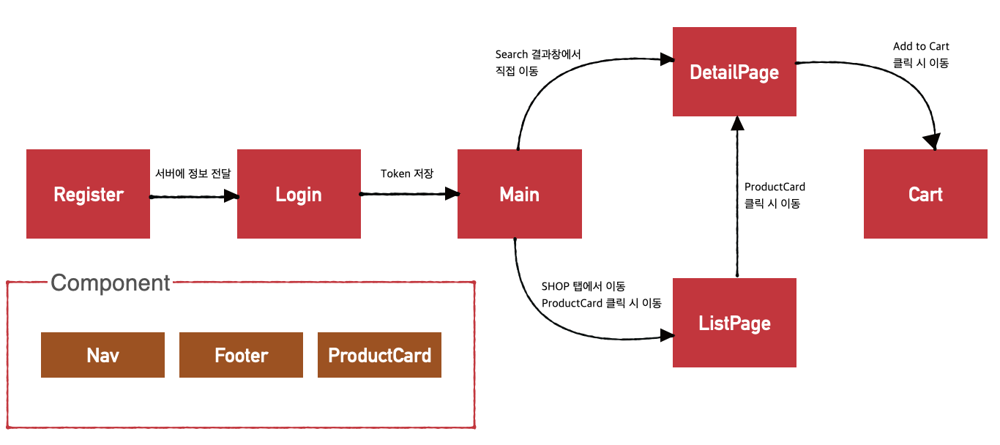

<div align="center">
  
</div>
  <br/>

<h1 align="center"> Kleenex </h1>
<h3 align="center"> 커피 원두 커머스 사이트 TERAROSA를 모티브한 1차 팀프로젝트 </h3> 
<br />

- 팀 명 : 크리넥스(kleenex)
- 팀 원: [최원익(PM)](https://github.com/Yelihi), [김영수](https://github.com/youngsoon12), [오창훈](https://github.com/och-changhoon), [김도연](https://github.com/kdylsky), [안상현](https://github.com/AhnSang0915)
  <br />


<h2 id="프로젝트소개"> :book: 프로젝트 소개</h2>

<p align="justify"> 
 다양한 세계의 커피 원두 및 식품 커머스 사이트 <b>TERAROSA</b>를 모티브로 진행된 1차 팀프로젝트 입니다. 커머스 사이트로서 가장 기본적이고 핵심적인 서비스를 제공하고 있었고, 단순 카페 체인점이 아닌 소비자의 니즈에 맞는 원두를 제작및 수입 판매하는 사이트라는 점에 있어서 흥미를 가지게 되어 모티브 사이트로 선정하였습니다.
 <br />
 커머스 사이트의 특징에 맞게, 결제 전 단계까지 구현하였으며 <b>로그인 -> 메인페이지 -> 검색 -> 상품리스트 -> 상세페이지 -> 장바구니</b> 순으로 이어집니다. React 를 제외한 외부 라이브러리는 사용하지 않았으며, 기존 테라로사 사이트에 없는 검색 기능을 추가하여 사용자가 조금 더 손쉽게 상품결제에 도달할 수 있도록 설계하였습니다. 
</p>

  <br />


<h2 id="팀원 소개"> :dart: 개발 기간 및 팀원</h2>

- 개발기간 : 2022/7/18 ~ 2022/7/29
- 개발 인원 : 프론트엔드 3명, 백엔드 2명
- Front : 최원익, 김영수, 오창훈
- Back : 김도연, 안상현
 <br />


<h2 id="사용 기술"> :fork_and_knife: Skills</h2>

- Front-end:     

- Back-end:   
 <br />


<h2 id="구현목표"> :floppy_disk: 구현 목표</h2>

> **필수 구현**

- 테라로사 메인 페이지 및 검색기능
- 회원가입 및 로그인 페이지
- 메인페이지 이미지 슬라이드
- 상품목록 페이지
- 개별 상품 상세 페이지
- 장바구니 페이지
 <br />

 


<h2 id="데이터모델링"> :floppy_disk: Data Modeling</h2>


<br />


<h2 id="담당하였던part"> :large_blue_diamond: 담당하였던 Part</h2>

### **Main.js**


<br>
<h3 id="main"> :scroll: Description</h3>

> **Opacity 를 활용한 슬라이드 구현**

<p align="justify"> 
 슬라이드를 구현할 때, 위 이미지와 같이 화면상에서 사진이 이동하는것이 아니라 다음사진이 사라졌다가 다시 나타나듯이 표현하고자 하였습니다. 클래스 'active' 를 적용할 시 사진이 나타나고, 나머지 사진은 opacity = 0 이 되어, 화면에 등장하지 않는 로직을 작성하려 하였습니다. 사진은 자동으로 슬라이드가 되고, 사용자가 임의로 슬라이드를 진행시킬 수 있습니다. 
 <br />
 <br />
 처음에는 state 상태를 객체로 저장하고, useEffect 의 의존성 배열에 상태값을 넣어서 슬라이드를 구현하였습니다. <b>하지만 이렇게 하면 추후 슬라이드 사진이 증가하거나 감소할때 수정하는것이 어려워진다는 것을 깨닫고, 방법을 아래처럼 변경하였습니다.</b>
</p>

```js
  const [imgId, setImgId] = useState(1);

  const showPrevImage = () => {
    imgId === 1 ? setImgId(IMAGE_DATA.length) : setImgId(prevId => prevId - 1);
  };

  const showNextImage = () => {
    imgId === IMAGE_DATA.length ? setImgId(1) : setImgId(prevId => prevId + 1);
  };

  useEffect(() => {
    const cycleImage = () => {
      imgId === IMAGE_DATA.length
        ? setImgId(1)
        : setImgId(prevId => prevId + 1);
    };

    const autoSlide = setInterval(cycleImage, 4000);
    return () => {
      clearInterval(autoSlide);
    };
  }, [imgId]);
```

<p align="justify"> 
 사진 데이터에 각각의 id 값을 부여합니다. <b>이후 state 를 id 와 같은 숫자로 지정한뒤, 현 state 와 id 의 일치여부에 따라 클래스 active 를 적용시킵니다.</b>
 <br><br> 이렇게 구현하게 되면, 만일 사진이 추가된다 한들, 기존 데이터에 추가로 사진을 넣어주기만 하면 됩니다.
</p>

```js
function Slide({ id, url, subTitle, Title1, Title2, imgId }) {
  return (
    <div className="slide">
      <div className={`mainSliderImage ${imgId === id ? 'active' : ''}`}>
        
        <div className="mainSliderText">
```
<br>


[더 자세한 내용은 블로그참조](https://rock7246.tistory.com/8?category=990492)


### **Login.js**


<br>
<h3 id="main"> :scroll: Description</h3>

> **아이디 저장 체크 기능**

<p align="justify"> 
  로그인을 하게 될 때 localstorage 와 연계하여 로그인한 아이디를 input 창에 저장시키는 기능을 구현했습니다. 아이디 저장 체크를 활성화 한 뒤 로그인을 하게 되면, 이후 로그아웃을 하였을 때, 로그인 창에 기존에 로그인하였던 아이디가 입력되어 있도록 설계하였습니다.
 <br />
 <br />
 체크가 활성화 되어있다면 localstorage 내부에 UserId 를 저장합니다.
</p>

```js
if (check === true) {
  // 체크가 되어있다면
  localStorage.setItem('UserId', inputValue.id); // 아이디 저장을 위해 localStorage 에 저장
}
```
<p align="justify"> 
  이후 로그아웃을 하게 되었을 때, 아이디 입력창에 localstorage 내에 저장되어있는 아이디가 입력되어있어야 했기에, useEffect 를 활용하여 컴포넌트가 랜더링 된 후 localstorage 내 value 값으로 아이디가 있는지 확인한 뒤, id input 창의 value 에 저장된 아이디를 입력시킵니다.
</p>

```js
  const isInputValueTrue = () => {
    isChecked.current === true
      ? setInputValue(prev => {
          return { ...prev, id: localStorage.getItem('UserId') };
        })
      : setInputValue(prev => {
          return { ...prev, id: '' };
        });
  };

  useEffect(() => {
    if (localStorage.getItem('UserId')) {
      isChecked.current = true;
      setIsAutoLoginChecked(true);
    }
    // 다음 isChecked 에 의해 화면 아이디 렌더링 여부를 결정합니다.
    isInputValueTrue();
  }, []);
```

<p align="justify"> 
  만일 로그인 할 때 체크박스를 비활성화 할 시 조건을 걸어서 localstorage 내 value(ID) 를 삭제하는 로직을 사용하였습니다. <br/><br/>
  이 외 유효성 검사를 통해서 서버에서 검사하기 전 프론트단에서도 검사하도록 하였습니다.
</p>

[더 자세한 내용은 블로그참조](https://rock7246.tistory.com/9?category=990492)

### **Cart.js**


<br>
<h3 id="main"> :scroll: Description</h3>

> **useEffect 의 라이프사이클 활용 서버의 과부화를 줄여보기**

<p align="justify"> 
  장바구니의 수량이 변경될때마다 (수량을 증가하거나 감소하거나) 변경된 상태값을 서버에 patch 요청하는 방식으로 로직을 구현하였다가, 만일 사용자가 많다는 가정하에 그 사용자들이 한번씩만 수량을 변경해도 서버에 전달되는 상태값은 많아질것이라 우려되어 고민하였습니다. <br/><br/>
  이를 해결해보기 위해 useEffect 의 라이프사이클 중 컴포넌트가 화면상에서 지워질떄(종료) 그 때의 수량 데이터를 서버에 전송하는 방법을 떠올려봤습니다.
</p>

```js
  async function addToCart() {
    const res = await fetch(`${CONFIG_URL}/cart/cart`, {
      method: 'PATCH',
      headers: {
        'Content-Type': 'application/json',
        authorization: localStorage.getItem('Token'),
      },
      body: JSON.stringify({
        cart_id: copyProducts.current.cart_id,
        quantity: copyProducts.current.quantity,
      }),
    });
    const result = await res.json();
  }

  // 렌더링 이후 request 를 불러옵니다.
  useEffect(() => {
    request();
    return () => {
      addToCart();
    };
  }, []);
```
<p align="justify"> 
  useEffect 내 return 안에 서버에 수량데이터를 patch 하는 함수 addToCart 를 실행시키도록 하였습니다. <br/><br/>
  즉, 사용자가 장바구니 내에서 수량을 변경하다가 구매로 들어가거나 혹은 이전 상세페이지로 이동하였을 때, 그 시점에 데이터는 서버에 전송이 되며, 이후 다시 장바구니 창으로 돌아오게 되면 이전에 변경했던 수량이 그대로 담겨져 있게 됩니다.
  이렇게 하여 서버에 수량 데이터를 전송하는 횟수를 줄일 수 있었습니다.<br/><br/>
  이 외 기본적으로 장바구니는 상품 선택 삭제(DELETE), 전체 삭제, 수량변경, 그리고 이러한 작업에 따른 실시간 상품 및 총 가격정보 변경 등을 구현하였습니다.
</p>

[더 자세한 내용은 블로그참조](https://rock7246.tistory.com/10?category=990492)


### **Search.js**


<br>
<h3 id="main"> :scroll: Description</h3>

<p align="justify"> 
  장바구니의 수량이 변경될때마다 (수량을 증가하거나 감소하거나) 변경된 상태값을 서버에 patch 요청하는 방식으로 로직을 구현하였다가, 만일 사용자가 많다는 가정하에 그 사용자들이 한번씩만 수량을 변경해도 서버에 전달되는 상태값은 많아질것이라 우려되어 고민하였습니다. <br/><br/>
  이를 해결해보기 위해 useEffect 의 라이프사이클 중 컴포넌트가 화면상에서 지워질떄(종료) 그 때의 수량 데이터를 서버에 전송하는 방법을 떠올려봤습니다.
</p>
